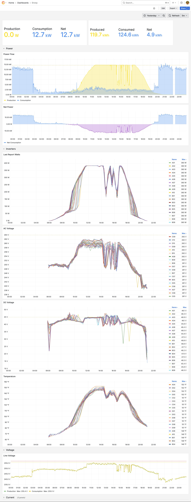

# InfluxDB Queries & Grafana Dashboard Examples

This document shows example InfluxDB queries used in Grafana dashboards for Envflux data, along with screenshots of the graphs.



## Dashboards Overview

- [Current Power - Stat](#current-power-stat)
- [Energy Summary - Stat](#energy-summary)
- [Power Flow - Time Series](#power-flow)
- [Net Power - Time Series](#net-power)
- [Inverters - Time Series](#inverters)
- [Voltage - Time Series](#voltage)

## Current Power
Stat visualization showing the most recent power readings during the selected time range.

**Influx Queries**

A:
```
from(bucket: "envoy")
  |> range(start: v.timeRangeStart, stop: v.timeRangeStop)
  |> filter(fn: (r) => r["_measurement"] == "system_production")
  |> filter(fn: (r) => r["_field"] == "watts_now")
  |> last()
  |> map(fn: (r) => ({ r with _field: "watts_now_production" }))
  |> yield()
```

B:
```
from(bucket: "envoy")
  |> range(start: v.timeRangeStart, stop: v.timeRangeStop)
  |> filter(fn: (r) => r["_measurement"] == "system_consumption")
  |> filter(fn: (r) => r["_field"] == "watts_now")
  |> last()
  |> map(fn: (r) => ({ r with _field: "watts_now_consumption" }))
  |> yield()
```

C:
```
from(bucket: "envoy")
  |> range(start: v.timeRangeStart, stop: v.timeRangeStop)
  |> filter(fn: (r) => r["_measurement"] == "system_net_consumption")
  |> filter(fn: (r) => r["_field"] == "watts_now")
  |> last()
  |> map(fn: (r) => ({ r with _field: "watts_now_net" }))
  |> yield()
```

## Energy Summary
Stat visualization showing total energy produced, consumed, net exported/imported for the selected time range.

**Influx Queries**

A:
```
first = from(bucket: "envoy")
  |> range(start: v.timeRangeStart, stop: v.timeRangeStop)
  |> filter(fn: (r) => r["_measurement"] == "system_production")
  |> filter(fn: (r) => r["_field"] == "watt_hours_lifetime")
  |> first()

last = from(bucket: "envoy")
  |> range(start: v.timeRangeStart, stop: v.timeRangeStop)
  |> filter(fn: (r) => r["_measurement"] == "system_production")
  |> filter(fn: (r) => r["_field"] == "watt_hours_lifetime")
  |> last()

join(
  tables: {first: first, last: last},
  on: ["_field"]
)
|> map(fn: (r) => ({
    _time: r._time,
    "watt_hours_produced": r._value_last - r._value_first
  }))
```

B:
```
first = from(bucket: "envoy")
  |> range(start: v.timeRangeStart, stop: v.timeRangeStop)
  |> filter(fn: (r) => r["_measurement"] == "system_consumption")
  |> filter(fn: (r) => r["_field"] == "watt_hours_lifetime")
  |> first()

last = from(bucket: "envoy")
  |> range(start: v.timeRangeStart, stop: v.timeRangeStop)
  |> filter(fn: (r) => r["_measurement"] == "system_consumption")
  |> filter(fn: (r) => r["_field"] == "watt_hours_lifetime")
  |> last()

join(
  tables: {first: first, last: last},
  on: ["_field"]
)
|> map(fn: (r) => ({
    _time: r._time,
    "watt_hours_consumed": r._value_last - r._value_first,
  }))
```

C:
```
first = from(bucket: "envoy")
  |> range(start: v.timeRangeStart, stop: v.timeRangeStop)
  |> filter(fn: (r) => r["_measurement"] == "system_net_consumption")
  |> filter(fn: (r) => r["_field"] == "watt_hours_lifetime")
  |> first()

last = from(bucket: "envoy")
  |> range(start: v.timeRangeStart, stop: v.timeRangeStop)
  |> filter(fn: (r) => r["_measurement"] == "system_net_consumption")
  |> filter(fn: (r) => r["_field"] == "watt_hours_lifetime")
  |> last()

join(
  tables: {first: first, last: last},
  on: ["_field"]
)
|> map(fn: (r) => ({
    _time: r._time,
    "watt_hours_net": r._value_last - r._value_first,
  }))
```

## Power Flow
Time series visualization showing production and consumption power

**Influx Queries**
A:
```
from(bucket: "envoy")
  |> range(start: v.timeRangeStart, stop: v.timeRangeStop)
  |> filter(fn: (r) => r["_measurement"] == "system_production")
  |> filter(fn: (r) => r["_field"] == "watts_now")
  |> aggregateWindow(every: v.windowPeriod, fn: mean, createEmpty: false)
  |> rename(columns: { _value: "Production" })
  |> keep(columns: ["_time", "Production"])
  |> yield(name: "Production")
```

B:
```
from(bucket: "envoy")
  |> range(start: v.timeRangeStart, stop: v.timeRangeStop)
  |> filter(fn: (r) => r["_measurement"] == "system_consumption")
  |> filter(fn: (r) => r["_field"] == "watts_now")
  |> rename(columns: { _value: "Consumption" })
  |> keep(columns: ["_time", "Consumption"])
  |> yield(name: "Consumption")
```

## Net Power
Time series visualization showing net power

**Influx Query**
```
from(bucket: "envoy")
  |> range(start: v.timeRangeStart, stop: v.timeRangeStop)
  |> filter(fn: (r) => r["_measurement"] == "system_net_consumption")
  |> filter(fn: (r) => r["_field"] == "watts_now")
  |> aggregateWindow(every: v.windowPeriod, fn: mean, createEmpty: false)
  |> rename(columns: { _value: "Net Consumption" })
  |> keep(columns: ["_time", "Net Consumption"])
  |> yield()
```

## Inverters
Time series visualization showing inverter stats (last_report_watts, dc_voltage, ac_voltage)

Modify the filter to select the field you want to visualize

**Influx Query**
```
from(bucket: "envoy")
  |> range(start: v.timeRangeStart, stop: v.timeRangeStop)
  |> filter(fn: (r) => r["_measurement"] == "inverters")
  |> filter(fn: (r) => r["_field"] == "last_report_watts")
  |> keep(columns: ["_time", "_value", "serial_number"])
  |> yield()
```

**Transformations**
1. Join by Field
  a. Mode: OUTER (TIME SERIES)
  b. Field: Time
2. Organize Fields by Name
  a. Use the "Organize Fields by Name" transformation to assign human-readable aliases to each inverter serial (e.g., A01, B01, C01) for easier legend reading.

## Voltage
Time series visualization showing voltage

**Influx Query**
```
from(bucket: "envoy")
  |> range(start: v.timeRangeStart, stop: v.timeRangeStop)
  |> filter(fn: (r) => r["_measurement"] == "ctmeter_production")
  |> filter(fn: (r) => r["_field"] == "voltage")
  |> aggregateWindow(every: v.windowPeriod, fn: max, createEmpty: false)
  |> rename(columns: { _value: "Production" })
  |> keep(columns: ["_time", "Production"])  // Clean legend and table
  |> yield(name: "Production")

from(bucket: "envoy")
  |> range(start: v.timeRangeStart, stop: v.timeRangeStop)
  |> filter(fn: (r) => r["_measurement"] == "ctmeter_consumption")
  |> filter(fn: (r) => r["_field"] == "voltage")
  |> aggregateWindow(every: v.windowPeriod, fn: max, createEmpty: false)
  |> rename(columns: { _value: "Consumption" })
  |> keep(columns: ["_time", "Consumption"])  // Clean legend and table
  |> yield(name: "Consumption")
```
